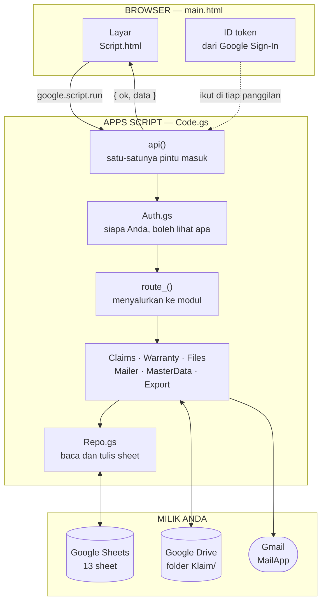
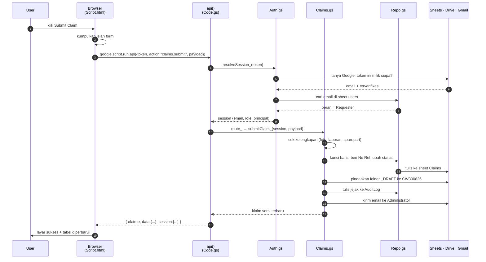
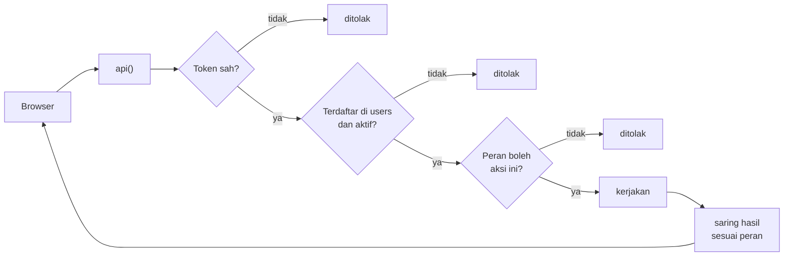
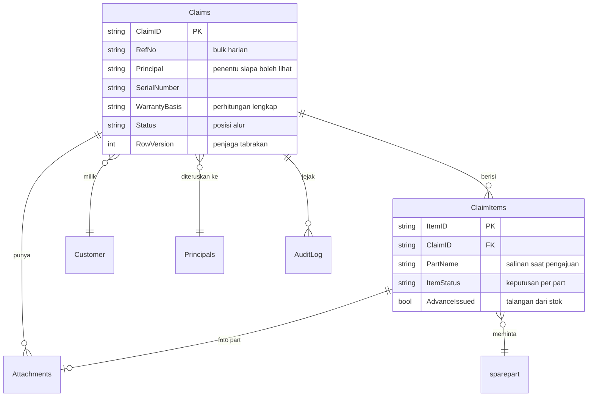
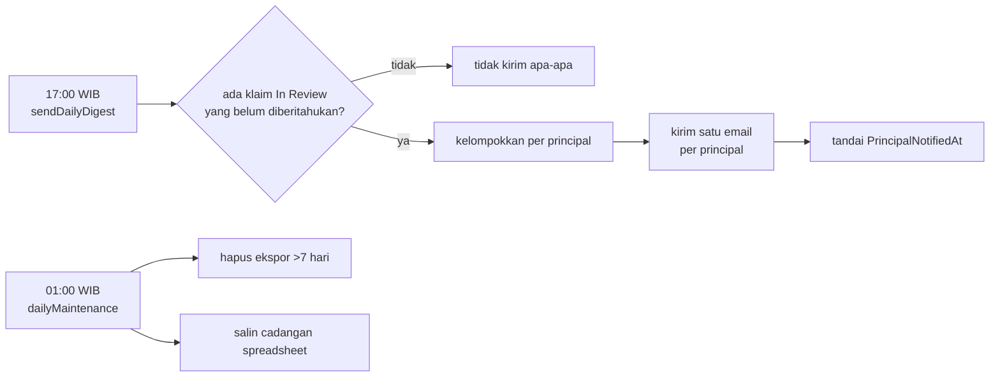

# Bagaimana kode ini bekerja

Dokumen ini menelusuri satu permintaan nyata dari klik sampai kembali ke layar. Sisanya mengikuti pola yang sama, jadi begitu satu alur ini terbaca, seluruh aplikasi ikut terbaca.

## Pertama: tidak ada berkas JSON, dan tidak ada database

Ini yang paling sering membingungkan di awal. Aplikasi ini hanya punya **tiga tempat penyimpanan**, dan JSON bukan salah satunya.

| Tempat | Isi | Contoh |
|---|---|---|
| **Google Sheets** | seluruh data | baris di sheet `Claims` |
| **Google Drive** | berkas lampiran | `CW300826_CLM-260826-0004_..._FAULT.jpg` |
| **Kode** | aturan, bukan data | rumus garansi 22 bulan |

JSON di sini bukan berkas, melainkan **bentuk pesan** saat browser dan server saling bicara. Ia lahir sesaat, dikirim, lalu hilang.

```
Baris di sheet          Objek JavaScript          Pesan ke browser
─────────────────       ──────────────────        ────────────────
CLM-260826-0004    →    { ClaimID: "CLM-…",   →   { claimId: "CLM-…",
RSUD Koja                 CustomerName: "RSUD…",     customerName: "RSUD…",
XT2410090                 SerialNumber: "XT24…" }    serialNumber: "XT24…" }
   (sheet)                    (Repo.gs)                  (Claims.gs)
```

Tiga bentuk, satu data. `Repo.gs` mengubah baris jadi objek; `Claims.gs` mengubah objek internal jadi bentuk yang aman dikirim ke layar — itulah sebabnya nama kolomnya `ClaimID` di sheet tapi `claimId` di browser. Yang dikirim hanya yang perlu dilihat.

## Susunan lapisannya



Perhatikan bahwa **panah dari browser hanya satu**. Itu disengaja, dan alasannya ada di bagian berikutnya.

## Menelusuri satu permintaan: user menekan "Submit Claim"



Langkah 4 sampai 8 terjadi pada **setiap** panggilan, bukan hanya saat submit. Itulah harga satu pintu masuk — dan alasannya.

## Kenapa hanya satu pintu

Apps Script sebenarnya mengizinkan browser memanggil fungsi mana pun yang namanya tidak diawali garis bawah. Godaannya besar: bikin `submitClaim()`, `deleteClaim()`, `approveItem()`, semuanya bisa dipanggil langsung.

Masalahnya, **setiap fungsi seperti itu adalah satu pintu yang harus dijaga sendiri.** Lupa satu, dan seseorang bisa memanggilnya langsung dari console browser tanpa melewati pemeriksaan apa pun.

Karena itu di seluruh `Code.gs` hanya ada dua fungsi yang bisa dijangkau browser:

```javascript
function doGet(e)        // menyajikan halaman
function api(request)    // segala hal lainnya
```

Seluruh fungsi lain berakhiran garis bawah — `submitClaim_`, `visibleClaims_`, `sendMail_` — dan Apps Script **menolak** memanggilnya dari browser. Satu pintu berarti satu tempat memeriksa token, satu tempat menentukan peran, satu tempat menangkap error.



Langkah terakhir sama pentingnya: **hasil disaring lagi sebelum dikirim.** Seorang Principal yang memanggil `claims.list` tidak menerima seluruh klaim lalu disembunyikan di layar — server memang hanya mengirim miliknya. Yang tidak terkirim tidak bisa dilihat, apa pun yang dilakukan orang di browser.

## Bentuk pesannya

Yang lalu-lalang selalu bentuk yang sama, apa pun aksinya.

**Dari browser:**

```json
{
  "token": "eyJhbGciOiJSUzI1NiIs…",
  "simulatedRole": null,
  "action": "claims.submit",
  "payload": { "claimId": "CLM-260830-0012", "rowVersion": 3 }
}
```

**Kembali dari server:**

```json
{
  "ok": true,
  "data": { "claimId": "CLM-260830-0012", "status": "Submitted", "…": "…" },
  "session": { "email": "rian@rs.co.id", "role": "Requester" }
}
```

**Kalau gagal:**

```json
{
  "ok": false,
  "error": "This claim still needs a service report.",
  "kind": "error"
}
```

Kegagalan **dikembalikan**, bukan dilempar. Sebabnya praktis: `google.script.run` hanya menyerahkan pesan error yang samar ke `withFailureHandler`, sehingga user akan melihat "Script error" alih-alih kalimat yang bisa ditindaklanjuti. Dengan cara ini, pesan yang muncul di layar adalah kalimat yang ditulis server.

`kind` menentukan reaksi browser:

| `kind` | Arti | Yang dilakukan browser |
|---|---|---|
| `auth` | token kedaluwarsa / tidak terdaftar | kembali ke layar masuk |
| `forbidden` | peran tidak berhak | tampilkan pesan |
| `stale` | ada yang menyimpan lebih dulu | tawarkan muat ulang atau tetap simpan |
| `error` | selebihnya | tampilkan pesan |

## Peta berkas

Ikuti arah panah di diagram pertama, dan tiap berkas jatuh pada tempatnya:

| Berkas | Menjawab pertanyaan |
|---|---|
| `Code.gs` | Permintaan masuk lewat mana, dan disalurkan ke mana |
| `Auth.gs` | Siapa ini, dan baris mana yang boleh dia lihat |
| `Warranty.gs` | Unit ini masih bergaransi? Milik principal mana? |
| `Claims.gs` | Apa yang boleh terjadi pada klaim, dan dalam urutan apa |
| `Files.gs` | Berkas disimpan di mana, dinamai bagaimana |
| `Mailer.gs` | Apa isi emailnya, siapa penerimanya |
| `MasterData.gs` | Daftar rujukan: user, principal, customer, sparepart |
| `Export.gs` | Bagaimana ini jadi berkas Excel |
| `Audit.gs` | Apa yang perlu dicatat, dan atas nama siapa |
| `Triggers.gs` | Apa yang berjalan sendiri, dan kapan |
| `Repo.gs` | Bagaimana baris sheet menjadi objek, dan sebaliknya |
| `Config.gs` | Nama kolom dan seluruh nilai tetap |
| `Setup.gs` | Apa yang dikerjakan sekali di awal |

## Bentuk datanya



Tiga hal yang menjelaskan kenapa bentuknya begini:

- **Keputusan ada di `ClaimItems`, bukan `Claims`.** Principal menyetujui per sparepart, jadi status keputusan harus menempel di sana. `Claims.Status` hanya menyatakan posisi alur.
- **`PartName` disalin, bukan cuma dirujuk.** Kalau nama sparepart di master diganti tahun depan, klaim lama tetap membaca nama yang benar-benar diajukan dulu — masalah yang dulu meninggalkan empat nama yatim di sheet `Log`.
- **`RowVersion` naik setiap penyimpanan.** Kalau dua orang membuka klaim yang sama, yang menyimpan belakangan membawa angka lama, dan server menghadangnya alih-alih menimpa diam-diam.

## Yang berjalan tanpa dipanggil

Tidak semuanya dimulai dari klik. Dua pemicu terjadwal berjalan sendiri:



`PrincipalNotifiedAt` adalah alasan pemicu ini aman dijalankan ulang: klaim yang sudah masuk email dilewati, dan klaim yang pengirimannya gagal tidak ditandai — jadi ikut lagi besok, bukan lenyap.

## Meringkas seluruhnya

```
User klik
   ↓
Browser kirim { token, action, payload }        ← satu bentuk, selalu
   ↓
api() periksa token → tentukan peran            ← satu pintu, selalu
   ↓
route_() salurkan ke modul yang tepat
   ↓
Modul kerjakan → tulis sheet → catat audit → kirim email
   ↓
Saring hasil sesuai peran                       ← yang tak boleh dilihat, tak dikirim
   ↓
Browser terima { ok, data } → perbarui layar
```

Enam baris itu berlaku untuk seluruh 30-an aksi di aplikasi ini. Yang berbeda hanya baris keempat.
